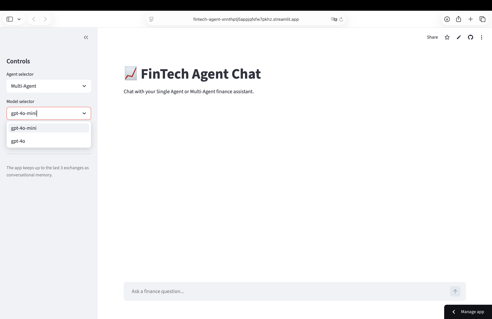
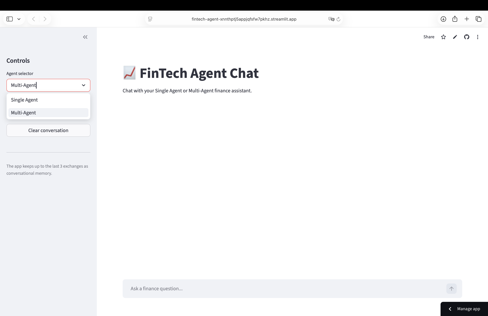
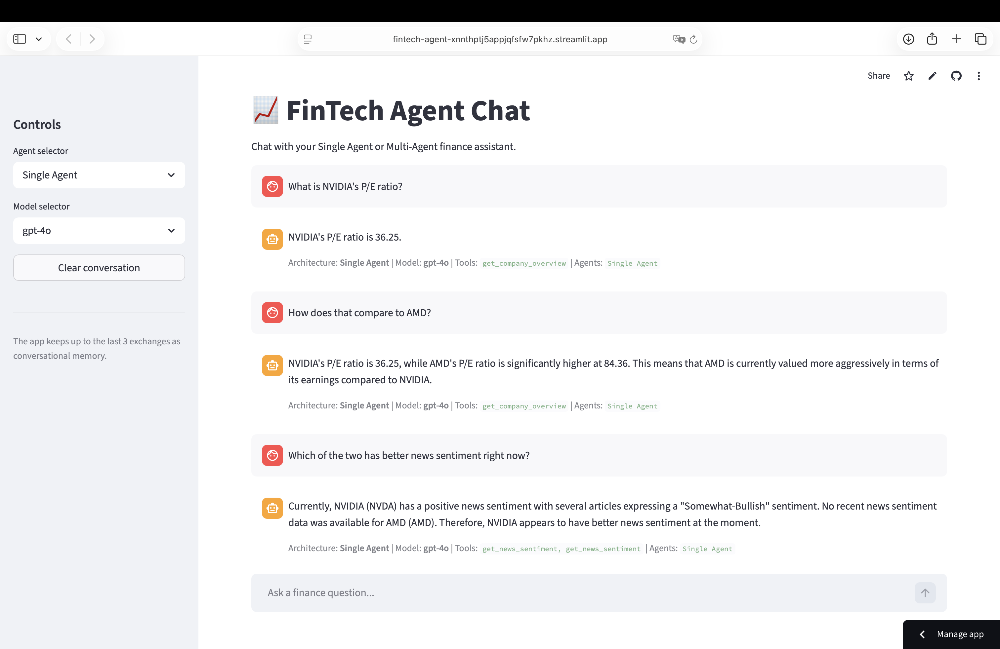

# FinTech-Agent

A FinTech agent with single-agent and multi-agent architectures for real-time stock analysis, company fundamentals, sector screening, and news sentiment.

## Live Demo

[Streamlit App](https://fintech-agent-xnnthptj5appjqfsfw7pkhz.streamlit.app/)

## Overview

FinTech Agent Chat is an agentic financial question-answering system built with **Streamlit**, **OpenAI**, **Alpha Vantage**, **yfinance**, and **SQLite**.

It supports two reasoning modes:

- **Single Agent**: one tool-augmented agent handles the full question end to end
- **Multi-Agent**: a specialist pipeline routes tasks across dedicated agents for market data, fundamentals, and sentiment

The app is designed for finance questions that require **live API calls**, **local database lookup**, and **multi-step reasoning** rather than static background knowledge alone.

## Features

- Real-time stock performance analysis
- Company fundamentals lookup, including:
  - P/E ratio
  - EPS
  - market cap
  - 52-week high / low
- Sector-based stock screening from a local SQLite database
- News sentiment analysis using recent financial headlines
- Switchable **Single Agent** and **Multi-Agent** architectures
- Switchable model selection (`gpt-4o-mini` / `gpt-4o`)
- Conversational memory for up to the last **3 exchanges**
- Streamlit-based interactive chat UI

## Architecture

### Single Agent
A single tool-augmented agent answers the full question by selecting and calling the necessary tools.

### Multi-Agent
A **sequential pipeline + aggregator** architecture with three specialists:

- **Market Agent**
  - sector / industry lookup
  - price performance
  - ranking by return
- **Fundamentals Agent**
  - company overview
  - valuation metrics such as P/E and EPS
- **Sentiment Agent**
  - recent news sentiment analysis

This design helps separate responsibilities and improves reliability on cross-domain finance questions.

## Tools

The system integrates the following tools:

- `get_price_performance` — price change over a selected period
- `get_company_overview` — company fundamentals from Alpha Vantage
- `get_tickers_by_sector` — sector / industry lookup from local database
- `get_news_sentiment` — latest sentiment from financial news
- `get_market_status` — market open / closed status
- `get_top_gainers_losers` — daily movers
- `query_local_db` — SQL queries on the local stock database

## Tech Stack

- **Frontend**: Streamlit
- **LLM**: OpenAI (`gpt-4o-mini`, `gpt-4o`)
- **Market Data**: yfinance
- **Fundamentals / News**: Alpha Vantage API
- **Database**: SQLite
- **Language**: Python

## Screenshots

### Model Selector


### Agent Selector


### Multi-turn Conversation Example


## Project Structure

```bash
.
├── streamlit_app.py        # Streamlit frontend
├── agent_backend.py        # Agent logic, tools, and routing
├── stocks.db               # Local SQLite database
├── sp500_companies.csv     # Source data for stock database
├── pic/
│   ├── model_select.png
│   ├── agent_select.png
│   └── conversation.png
└── README.md
